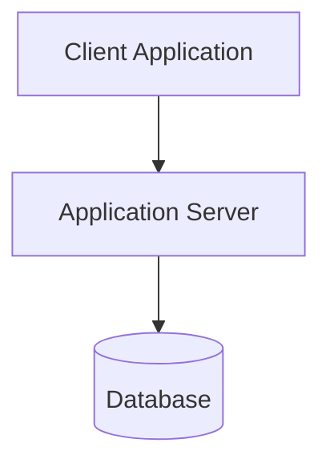

# Design Architecture

## Why this exists

The most expensive failures in agent-assisted projects are quiet architectural
misalignments: an undefined API strategy resulting in inconsistent endpoint conventions,
vague module boundaries leading to circular dependencies, or speculative over-engineering.

This skill front-loads structural decisions into clear system blueprints in
`docs/architecture/` and durable Architectural Decision Records in `docs/adr/`
so every coding session builds against an agreed-upon technical standard.

## Prerequisites

1. **Read Specifications First**: Read all relevant feature specs in `docs/specs/`
   (e.g., `docs/specs/<feature>.md`), existing architecture docs in `docs/architecture/`,
   and past decisions in `docs/adr/`.
2. **Derive, Don't Guess**: Architecture must directly fulfill the requirements and
   acceptance criteria in the specs within stated constraints. If you find yourself
   designing functionality not requested in any spec, stop.
3. **Respect Existing Code**: If the repository already has code, inspect its
   structure first. An architecture that ignores the existing codebase is a rewrite
   proposal, which requires explicit user sign-off.
4. **Require Sufficient Requirements**: Use an existing spec, issue, or clear user
   request as the contract. Invoke `write-spec` only when missing requirements would
   materially change the design.

When a change introduces meaningful behavior, integrations, persistence, or failure
modes, read [`references/testing-strategy.md`](references/testing-strategy.md) and
record the relevant test boundaries in the architecture deliverable. Do not prescribe
a new testing stack when the repository already has an adequate one.

## Core Architectural Principles

- **Boring Technology Wins**: Choose proven, mainstream technologies that satisfy
  requirements. Novel tech requires explicit justification tied to a hard constraint.
- **Fewest Moving Parts**: Every added database, message queue, or microservice
  increases cognitive load, failure modes, and CI complexity. Default to a modular
  monolith with a single datastore until requirements demand otherwise.
- **Every Choice Has a One-Line "Why"**: Every stack choice and boundary must include
  a clear rationale so future sessions don't re-litigate decisions.
- **YAGNI (You Aren't Gonna Need It)**: Do not design speculative abstractions for
  hypothetical future features. Design cleanly for today's requirements, and note
  genuine future scalability considerations under *Risks & Trade-offs*.

## Deliverable 1: `docs/architecture/system-overview.md`

Author or update `docs/architecture/system-overview.md` with the following structure:

```markdown
# System Architecture

## 1. Stack & Technologies
| Layer | Choice | Rationale / Trade-off |
|---|---|---|
| Language / Runtime | ... | ... |
| Framework | ... | ... |
| Database / Storage | ... | ... |
| API / Transport | ... | ... |
| Styling / Design Tokens | ... | (Owned by maintain-design-system skill) |

## 2. High-Level Architecture
[2–3 concise sentences explaining the primary components and data flow.]



## 3. Module Boundaries
[Define the directory layout and module contracts. Specify what each module owns
and what it MUST NOT import or depend on.]

- `src/core/`: [Domain models & business logic. Zero external UI dependencies.]
- `src/api/`: [Routing, serialization, validation, HTTP handlers.]
- `src/storage/`: [Database repositories, migrations, connection pools.]
- `src/ui/`: [UI components & views. References design tokens exclusively.]

## 4. Data Model & Schema
[Entities, field definitions, primary/foreign keys, indexes, and relationships.
Detailed enough to write migrations or ORM schemas without invention.]

## 5. API Strategy & Interface Contracts
- **Protocol & Style**: [REST / gRPC / GraphQL / tRPC]
- **Naming Conventions**: [e.g. kebab-case URLs, camelCase JSON payloads]
- **Error Response Standard**:
  ```json
  {
    "error": {
      "code": "INVALID_INPUT",
      "message": "Human readable message",
      "details": []
    }
  }
  ```
- **Auth Strategy**: [e.g. Bearer JWT / Session Cookies / API Key]
- **Versioning Stance**: [e.g. URL path `/api/v1` or header-based]

## 6. Cross-Cutting Concerns
- **Error Handling**: [How errors propagate, map to HTTP codes, and get logged]
- **Logging & Observability**: [Structured JSON logs to stdout, trace IDs]
- **Testing Strategy**: [Unit tests, integration tests, test runner commands]
- **Configuration & Secrets**: [Env vars validated at startup via schema (Zod/Pydantic)]

## 7. Build & Run
[Exact, copy-pasteable commands to install, run locally, test, and build.]
- **Install**: `npm install` (or equivalent)
- **Dev**: `npm run dev`
- **Test**: `npm test`
- **Build**: `npm run build`

## 8. Implementation Milestones
1. **Milestone 1 (Walking Skeleton)**: [Smallest end-to-end slice proving architecture; list exact files to create]
2. **Milestone 2 (Core Domain & R1)**: [Next coherent slice referencing requirement IDs]
3. **Milestone 3 (Integration & R2..Rn)**: ...

## 9. Risks & Open Questions
- [Unresolved risks, third-party limitations, or questions with proposed mitigations]
```

## Deliverable 2: Architectural Decision Records (`docs/adr/`)

For any significant, non-obvious, or contested technical decision (e.g. database choice,
auth strategy, state management approach), create a dedicated ADR file in `docs/adr/`:

`docs/adr/YYYY-MM-DD-<decision-title>.md` (or `docs/adr/0001-<decision-title>.md`):

```markdown
# ADR: [Short Title of Decision]

* **Status**: Accepted
* **Deciders**: [Architect / User]
* **Date**: [YYYY-MM-DD]
* **Related Spec**: [docs/specs/<feature>.md]

## Context & Problem Statement
[What problem needed solving? What constraints applied?]

## Considered Options
1. **[Chosen Option]**
2. **[Alternative Option A]**
3. **[Alternative Option B]**

## Decision Outcome
Chosen option: **[Chosen Option]**, because [concrete justification tied to requirements/constraints].

### Positive Consequences
- [Benefit 1]
- [Benefit 2]

### Trade-offs & Mitigations
- [Accepted cost or limitation]
- [Mitigation strategy]
```

## Revising Architecture

When requirements shift or implementation reveals new constraints, update
`docs/architecture/system-overview.md` in place so it remains currently true.
Document the architectural pivot by adding a new ADR in `docs/adr/` referencing
the superseded decision.
