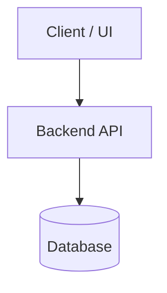

# System Architecture

## 1. Stack & Technologies
| Layer | Technology | Rationale |
|---|---|---|
| Runtime / Language | ... | ... |
| Framework | ... | ... |
| Database | ... | ... |
| Styling / UI | ... | ... |

## 2. High-Level Architecture
[2–3 sentences describing the high-level system components and their interactions.]



## 3. Module Boundaries
[Define the directory structure and module contracts. What each module owns and what it MUST NOT depend on.]

- `src/core/`: [Owns domain logic. Zero external UI dependencies.]
- `src/api/`: [Owns routing, input validation, serialization.]
- `src/ui/`: [Owns UI components and views. References design tokens.]

## 4. API & Data Strategy
- **API Style**: [REST / RPC / GraphQL]
- **Naming Conventions**: [e.g. kebab-case endpoints, camelCase JSON keys]
- **Error Response Shape**:
  ```json
  {
    "error": {
      "code": "RESOURCE_NOT_FOUND",
      "message": "Human readable message"
    }
  }
  ```
- **Auth Strategy**: [Session / Bearer JWT / API Key]

## 5. Cross-Cutting Concerns
- **Logging**: [Structured JSON logs to stdout]
- **Configuration**: [Environment variables loaded via config schema]
- **Testing**: [Unit tests in `tests/unit/`, integration in `tests/integration/`]

## 6. Build & Run
- **Install**: `npm install` (or equivalent)
- **Dev Server**: `npm run dev`
- **Test**: `npm test`
- **Build**: `npm run build`
